# Containerizing and Deploying a Java Web Application

TDSE course workshop — a virtualization workshop covering Docker packaging and deployment of a Java web application.

## Workshop status

| Part | Description | Status |
|---|---|---|
| 1 | Java web application with Spring Boot | ✅ Complete |
| 2 | Docker image + isolated containers | ✅ Complete |
| 3 | Multi-container environment with Docker Compose | ✅ Complete |
| 4 | Publishing the image to Docker Hub | ✅ Complete |
| 5 | Deployment on AWS EC2 | ✅ Complete |
| 6 | Deployment model + cost analysis | ✅ Complete |

## Technology stack

- Java 21 (Amazon Corretto)
- Maven
- Spring Boot 4.1.1
- Docker Desktop + Docker Compose v2
- Docker Hub (`danielpm1912`)
- MongoDB 7 (auxiliary container, no data persistence used yet)
- AWS EC2 (Amazon Linux 2023)

## Part 1 — Web application

Maven project (`pom.xml`) with the `spring-boot-starter-web` dependency and a REST controller:

[HelloRestController.java](src/main/java/edu/co/escuelaing/containerizing_and_deploying_a_java_web_app/controller/HelloRestController.java)

```java
@RestController
public class HelloRestController {

    @GetMapping("/greeting")
    public String greeting(@RequestParam(value = "name", defaultValue = "World") String name) {
        return "Hello, " + name + "!";
    }
}
```

The port is read from the `PORT` environment variable (defaults to `8000` if not set), defined in [ContainerizingAndDeployingAJavaWebAppApplication.java](src/main/java/edu/co/escuelaing/containerizing_and_deploying_a_java_web_app/ContainerizingAndDeployingAJavaWebAppApplication.java):

```java
application.setDefaultProperties(
        Map.of("server.port", System.getenv().getOrDefault("PORT", "8000")));
```

### Build and run locally

```bash
mvn clean package
java -jar target/*.jar
```

### Evidence

| Test | Screenshot |
|---|---|
| `GET /greeting` (default value) | 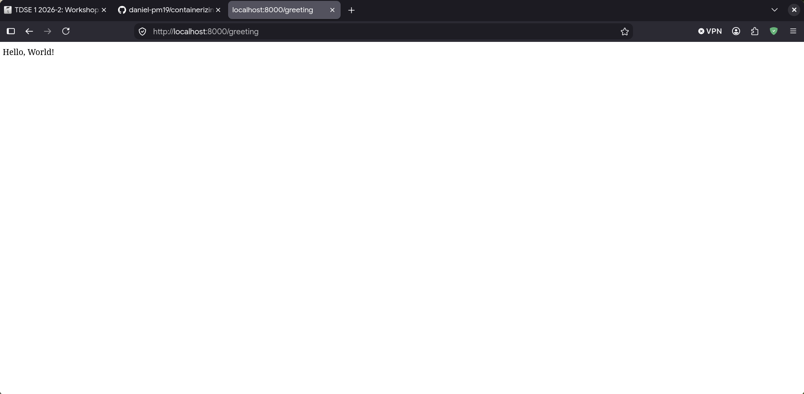 |
| `GET /greeting?name=Pedro` |  |

## Part 2 — Docker image and isolated containers

### Dockerfile

```dockerfile
FROM amazoncorretto:21

WORKDIR /app

COPY target/*.jar app.jar

ENV PORT=8000

EXPOSE 8000

ENTRYPOINT ["java", "-jar", "app.jar"]
```

### Building the image

```bash
docker build -t danielpm1912/virtualization-lab:1.0 .
docker images
```

### Running a container

```bash
docker run -d \
  --name virtualization-lab-1 \
  -e PORT=6000 \
  -p 34000:6000 \
  danielpm1912/virtualization-lab:1.0
```

### Isolation: multiple instances of the same image

```bash
docker run -d --name virtualization-lab-2 -e PORT=8000 -p 34001:8000 danielpm1912/virtualization-lab:1.0
docker run -d --name virtualization-lab-3 -e PORT=8000 -p 34002:8000 danielpm1912/virtualization-lab:1.0
```

Each container runs in isolation, with its own process and internal port space, exposed on a different host port (`34000`, `34001`, `34002`).

### Evidence

| Step | Screenshot |
|---|---|
| `docker build` | 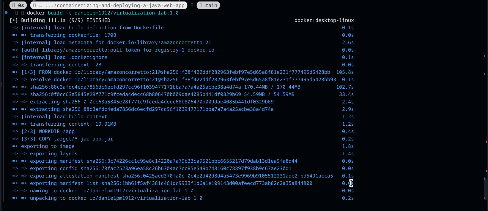 |
| `docker images` | 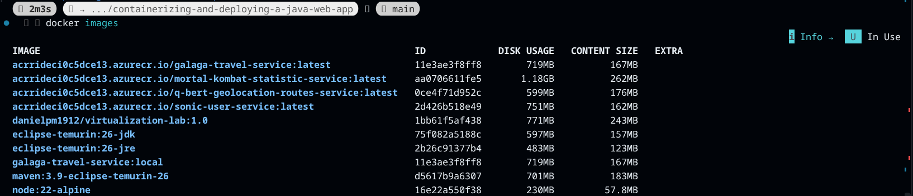 |
| `docker run` container 1 | 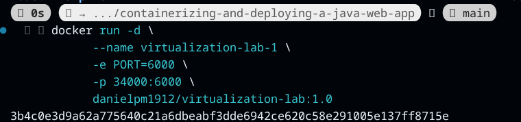 |
| `docker ps` | 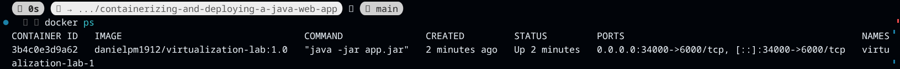 |
| Container 1 responding | 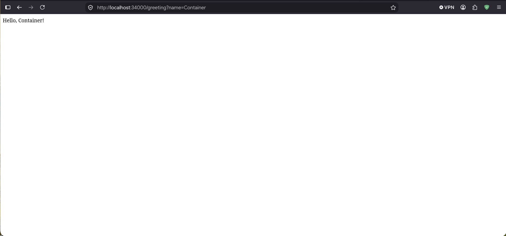 |
| `docker run` containers 2 and 3 | 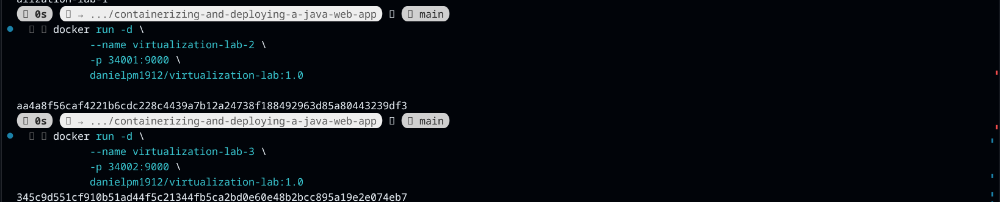 |
| Container 2 responding | 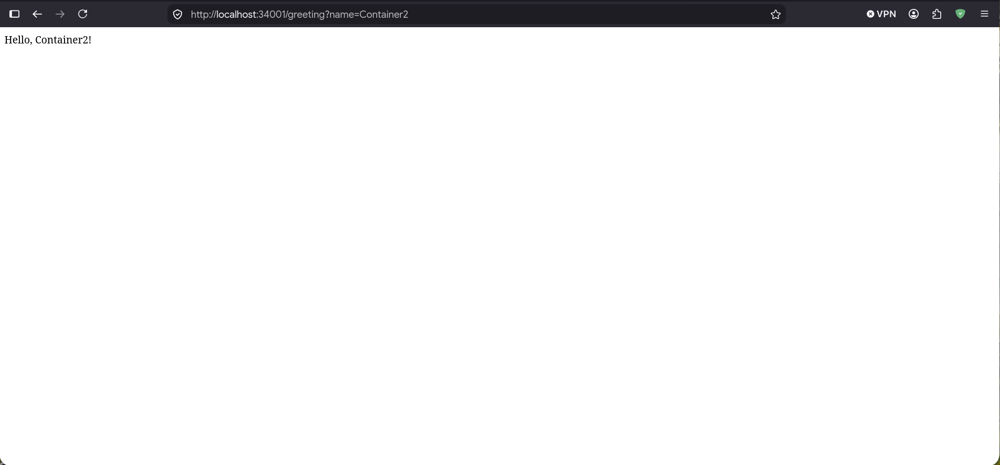 |
| Container 3 responding | 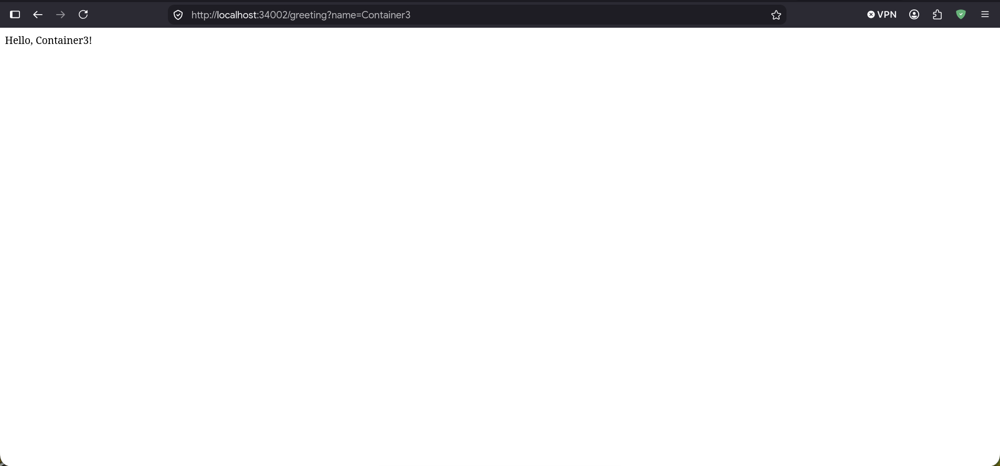 |

### Issue found and fixed: port mapping

When recreating containers 2 and 3, container port `9000` was published (`-p 3400x:9000`) while the `PORT` variable was set to `8000`. In other words, Spring Boot was listening on `8000`, but Docker was forwarding traffic to `9000`, where nothing was listening. Result: the containers were `Up` but not responding.

**Lesson:** the right-hand side of `-p host:container` must always match the actual `PORT` value the application receives inside the container.

```bash
docker run -d --name virtualization-lab-2 -e PORT=8000 -p 34001:8000 danielpm1912/virtualization-lab:1.0
docker run -d --name virtualization-lab-3 -e PORT=8000 -p 34002:8000 danielpm1912/virtualization-lab:1.0
```

## Part 3 — Docker Compose (web + MongoDB)

[compose.yaml](compose.yaml) defines two services on the same Docker network: `web` (the application) and `db` (MongoDB, no data persistence used yet — the volume exists only to practice Compose's volume management).

```yaml
db:
  image: mongo:7
  container_name: virtualization-db
  volumes:
    - mongodb:/data/db
    - mongodb_config:/data/configdb
  ports:
    - "27017:27017"
  command: mongod
```

```bash
docker compose up -d --build
docker compose ps
docker compose logs web
docker compose logs db
```

### Evidence

| Step | Screenshot |
|---|---|
| `docker compose up -d --build` | 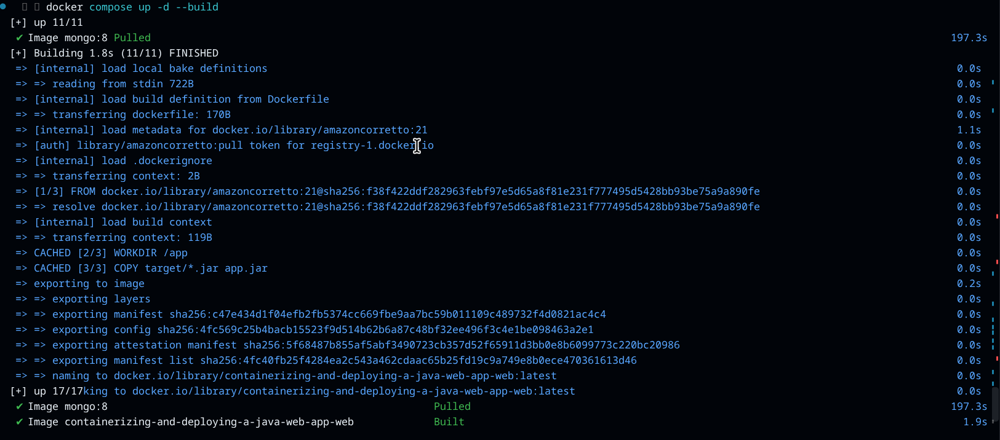 |
| `docker compose logs web` | 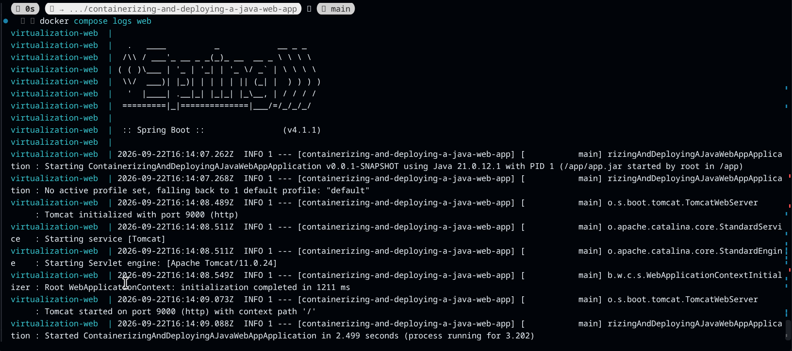 |
| `web` service responding on `:8087` | 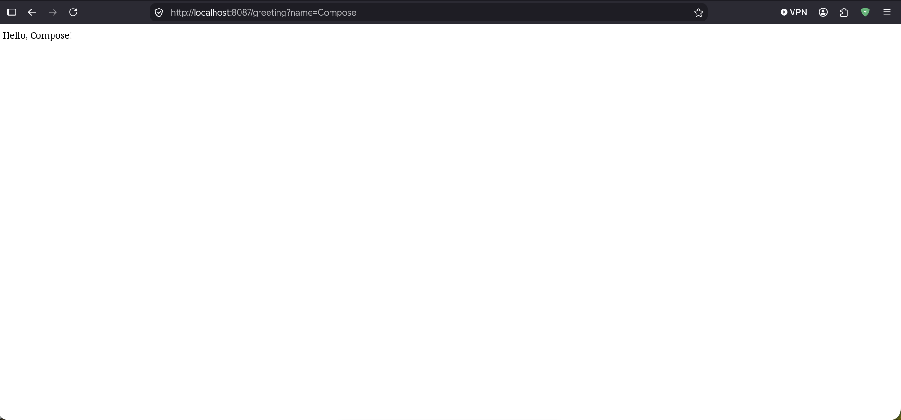 |
| `docker compose ps` (web + db up) | 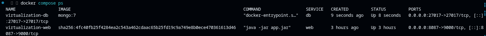 |
| `docker compose logs db` | 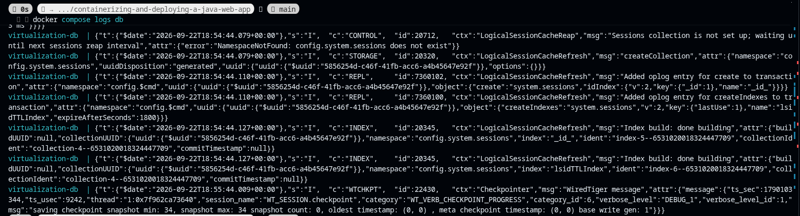 |
| `docker compose exec db mongosh` | 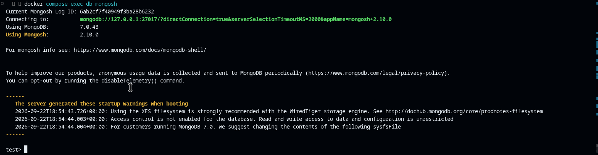 |
| `insertOne` / `find()` on `workshop.messages` | 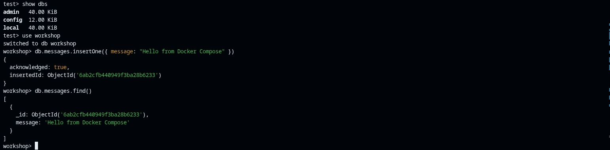 |
| `docker compose down` / `docker compose down -v` | 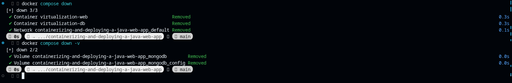 |

### Issue found and fixed: `mongo:8` incompatibility with the kernel

The official `mongo:8` image would not start on this machine:

```
MongoDB cannot start: Linux kernel versions 6.19 and newer has a known
incompatibility with this version of MongoDB.
```

This is an incompatibility between `mongo:8` and the host's Linux kernel (CachyOS, recent kernel), not a Compose configuration error. Since the application doesn't use MongoDB for anything yet, `/greeting` kept responding normally even with `db` down, because `depends_on` only waits for the container to **start**, not to be healthy.

**Fix:** the image was downgraded to `mongo:7` in `compose.yaml`. With that change the `db` container starts correctly (evidence above), and it was possible to connect with `mongosh` and run an `insertOne`/`find()` without issues.

## Part 4 — Publishing to Docker Hub

**Repository:** [danielpm1912/virtualization-lab](https://hub.docker.com/r/danielpm1912/virtualization-lab) (public)

```bash
docker login

docker tag danielpm1912/virtualization-lab:1.0 \
  danielpm1912/virtualization-lab:latest

docker push danielpm1912/virtualization-lab:1.0
docker push danielpm1912/virtualization-lab:latest
```

### Evidence

| Step | Screenshot |
|---|---|
| `docker login` | 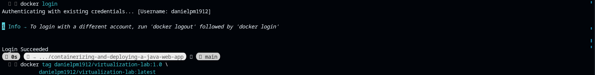 |
| `docker push` (tags `1.0` and `latest`) | 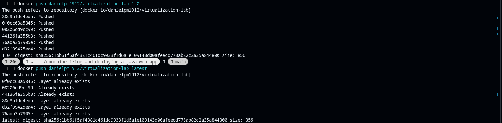 |
| Public repository on Docker Hub | 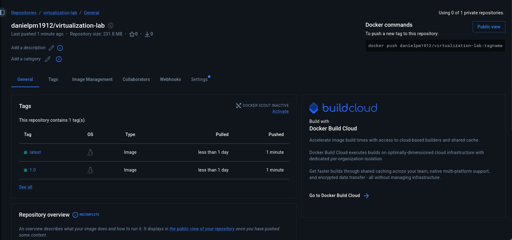 |

## Part 5 — Deployment on AWS EC2

**Amazon Linux 2023** instance, region `us-east-1` (US East, N. Virginia).

### Security Group

The Security Group went through three stages during the workshop:

**1. Initial configuration, during testing (no surviving screenshot — overwritten by later captures):** besides the application port, ports 8000 and 9000 were also left open, all to `0.0.0.0/0` (any source), even though the container only ever used one port at a time.

**Lesson learned:** a Security Group should be restricted to only the port actually exposed by the application and to the source that genuinely needs access, closing any port that is no longer in use.

**2. First correction — both rules restricted to the author's own IP:**

| Rule | Port | Source |
|---|---|---|
| SSH | 22 | `186.29.182.185/32` |
| App | 8080 | `186.29.182.185/32` |

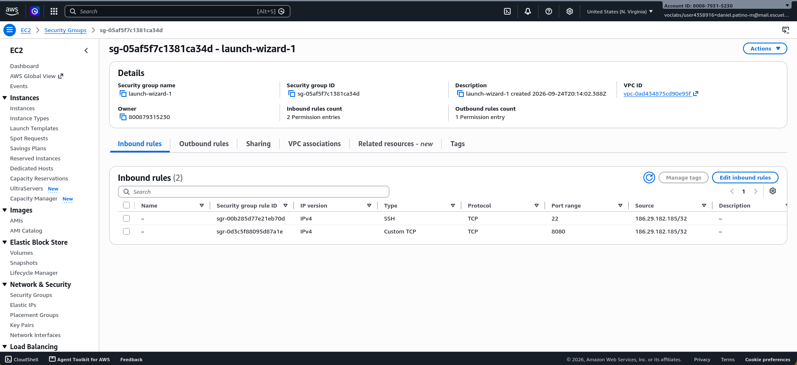

This closed the extra ports, but restricting 8080 to a single IP also meant nobody else (e.g. a grader) could reach the public URL — too strict for a deployment that needs to be publicly verifiable.

**3. Final configuration — SSH locked down, application port public:**

| Rule | Port | Source |
|---|---|---|
| SSH | 22 | `186.29.182.185/32` |
| App | 8080 | `0.0.0.0/0` |

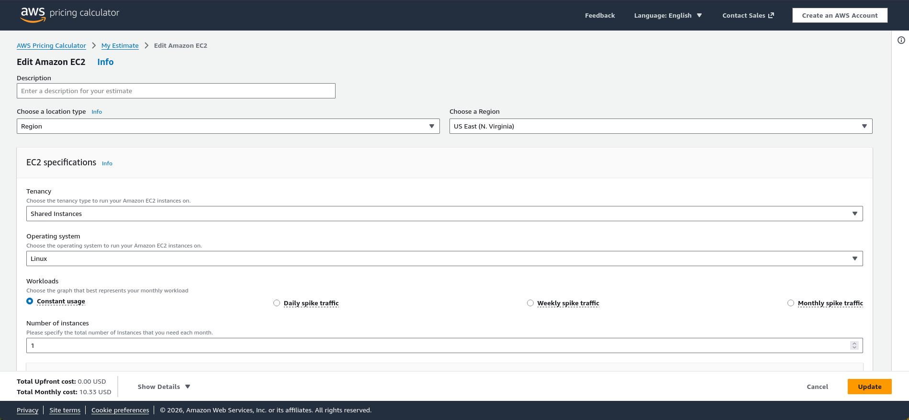

This is the configuration kept for the deployment: administrative access (SSH) stays restricted to the author's IP, while the application port is open to the world since the whole point of a public deployment is that it be reachable.

### Connecting and installing Docker

```bash
chmod 400 firstkey.pem
ssh -i firstkey.pem ec2-user@<ec2-public-dns>

sudo yum update -y
sudo yum install -y docker
sudo service docker start
sudo usermod -a -G docker ec2-user
```

| Step | Screenshot |
|---|---|
| SSH connection | 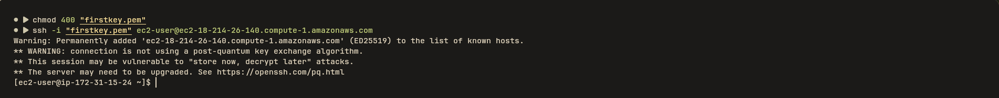 |
| `yum update` / `yum install docker` | 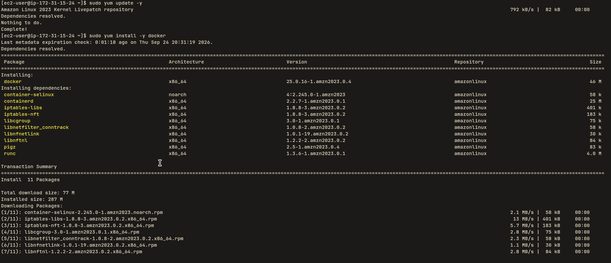 |
| `service docker start` / `usermod` | 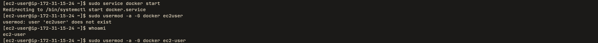 |

### Running the container

```bash
docker pull danielpm1912/virtualization-lab:1.0

docker run -d \
  --name virtualization-lab \
  --restart unless-stopped \
  -e PORT=9000 \
  -p 8080:9000 \
  danielpm1912/virtualization-lab:1.0
```

| Step | Screenshot |
|---|---|
| `docker run` | 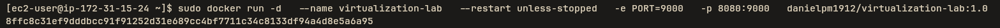 |
| `docker ps` + `docker logs` | 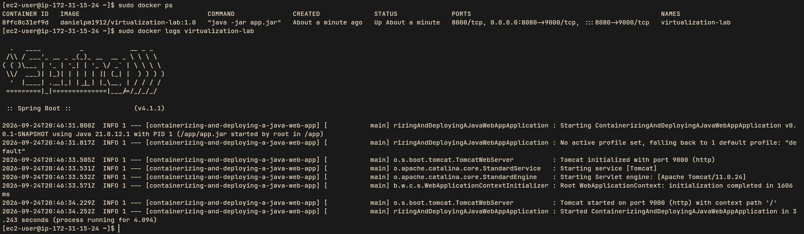 |

### Verification

**Public URL (historical evidence):** `http://18.214.26.140:8080/greeting?name=AWS`


> The instance was terminated after capturing this evidence to avoid unnecessary charges, as recommended by the workshop. The URL is no longer active; the screenshot is the evidence of the working deployment.

## Part 6 — Deployment model and cost analysis

### Deployment model diagram

```
Client
  │ HTTP request (port 8080)
  ▼
EC2 (Amazon Linux 2023, us-east-1)
  │
  ▼
Docker Engine
  │
  ▼
Container: Java web application (Spring Boot, internal port 9000)
```

**Responsibility of each layer:**

- **EC2 instance:** isolated compute, memory, storage (EBS), and network resources, rented by the hour.
- **Docker container:** portable execution environment that packages the application together with its runtime (Amazon Corretto 21 JRE), independent of the rest of the host operating system.
- **Java application (Spring Boot):** receives HTTP requests on `/greeting` and provides the business functionality.
- **Security Group:** controls which inbound traffic can reach the instance; it is the only network access control point in this deployment (no load balancer or WAF in front).

### Workload assumptions

> The three scenarios were calculated by editing a single AWS Pricing Calculator estimate (same EC2 instance), varying only the outbound data transfer between runs. The base configuration (instance, OS, EBS, monitoring) was verified both by exporting the estimate's JSON and with direct screenshots of the calculator's configuration panel:

| Configuration panel | Screenshot |
|---|---|
| Region, tenancy, OS, workload type, instance count | 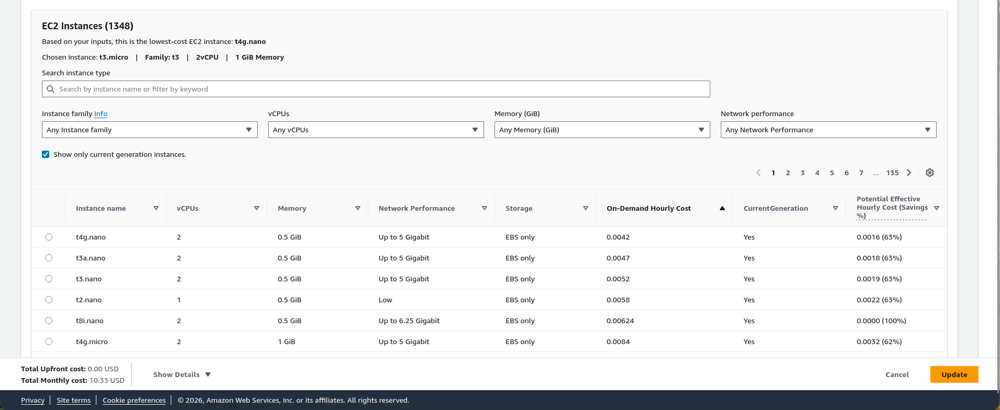 |
| Instance selection (`t3.micro`, 2 vCPU, 1 GiB) | 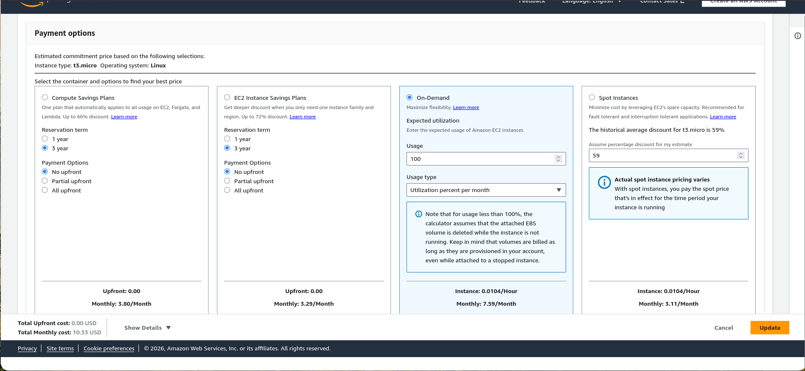 |
| Payment options (On-Demand, 100% utilization) | 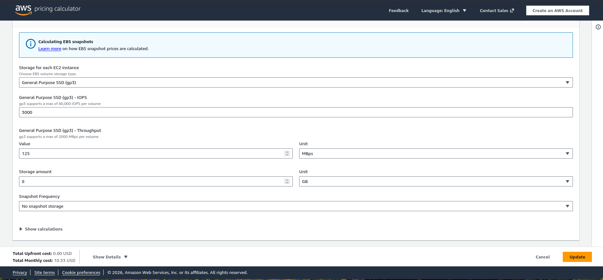 |
| Detailed monitoring enabled | 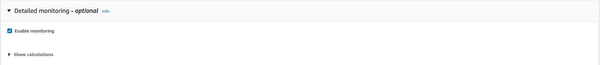 |

| Assumption | Small | Medium | Large |
|---|---|---|---|
| AWS Region | US East (N. Virginia) | US East (N. Virginia) | US East (N. Virginia) |
| EC2 instance type | t3.micro (Shared Tenancy, Linux) | t3.micro (Shared Tenancy, Linux) | t3.micro (Shared Tenancy, Linux) |
| Number of instances | 1 | 1 | 1 |
| Pricing strategy | On-Demand | On-Demand | On-Demand |
| Monthly runtime hours | 730 (100% utilization/month) | 730 (100% utilization/month) | 730 (100% utilization/month) |
| Detailed monitoring (CloudWatch) | Enabled | Enabled | Enabled |
| EBS storage | 8 GB | 8 GB | 8 GB |
| Outbound data transfer (Internet) | 0.1 GB/month | 1 GB/month | 10 GB/month |
| Average request/response size | ~1 KB / ~1 KB | ~1 KB / ~1 KB | ~1 KB / ~1 KB |
| Runs continuously or on a schedule? | Continuous | Continuous | Continuous |
| Requires high availability? | No | No | No (though it approaches the limit of a single small instance) |

### Cost estimate (AWS Pricing Calculator)

| Scenario | Monthly requests | Estimated monthly cost | Estimated cost per request | Main cost drivers |
|---|---|---|---|---|
| Small workload | 10,000 | USD 10.33 | USD 0.001033 | EC2 runtime (730h), EBS, and CloudWatch monitoring — data transfer (0.1 GB) is negligible |
| Medium workload | 100,000 | USD 10.42 | USD 0.0001042 | Same base as Small, plus network transfer (1 GB) |
| Large workload | 1,000,000 | USD 11.23 | USD 0.00001123 | Same base as Small, plus network transfer (10 GB) — the largest increase of the three scenarios |

*(Cost per request = monthly infrastructure cost / monthly requests)*

**Evidence:**

| Scenario | AWS Pricing Calculator screenshot |
|---|---|
| Small | 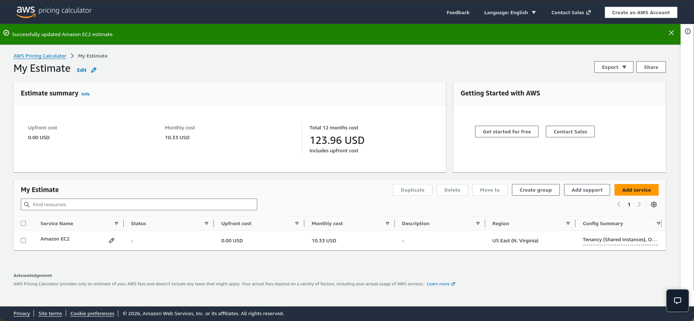 |
| Medium |  |
| Large | 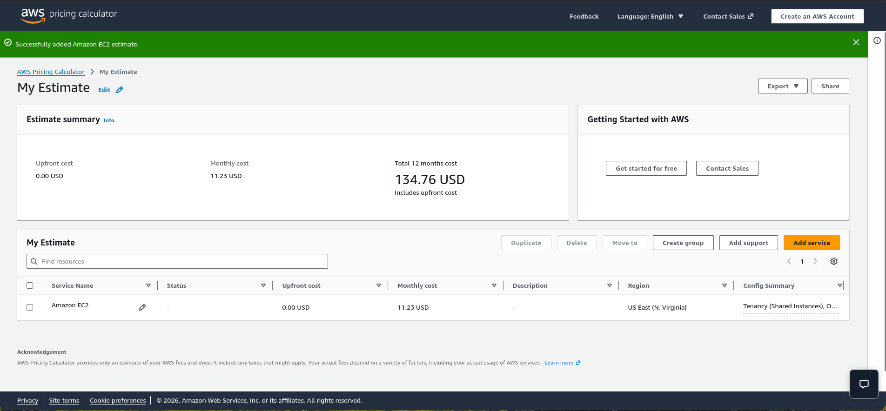 |
| Summary table | 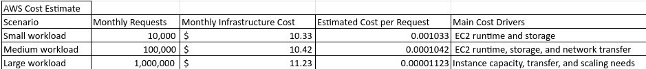 |

### Architectural discussion

**Why does an EC2-based deployment have a baseline monthly cost even with few requests?**
Because you are paying for a reserved compute instance (CPU, RAM) and its associated EBS storage for as long as the instance exists, regardless of whether it receives traffic. Unlike a serverless model, the cost here is tied to *how long the resource exists*, not to the invocations it processes. In this workshop, that ~10 USD/month corresponds almost entirely to the `t3.micro` running for 730 hours and to EBS, not to the 10,000 requests themselves.

**At which workload level does the fixed cost become less significant per request?**
Comparing the three scenarios, the total cost barely changes (10.33 → 10.42 → 11.23 USD) while requests multiply by 100. This means the cost per request drops almost linearly with volume: in Small it is ~100 times more expensive per request than in Large. The fixed cost (instance + EBS) probably stops "being felt" starting around the Medium scenario (100,000 requests/month) onward, where the cost per transaction is already below USD 0.0001 and approaches the technical minimum achievable with this instance.

**What would force a move from one instance to multiple instances?**
Not the request volume of this workshop (a `t3.micro` easily handles 1,000,000 requests/month for a simple endpoint), but rather: (1) the need for high availability/fault tolerance (a single instance is a single point of failure), (2) concurrency spikes that exceed the instance's CPU/RAM, (3) the need for zero-downtime deployments (rolling deployments), or (4) geographic distribution requirements (multiple regions).

**Which additional services would a production deployment require?**
An Application Load Balancer (to distribute traffic and allow multiple instances/availability zones), an Auto Scaling Group, a managed database (Amazon DocumentDB or Atlas instead of MongoDB in a container without real persistence), CloudWatch for monitoring and alarms, automated backups of the EBS volume/database, and a managed container registry (Amazon ECR) instead of relying on Docker Hub for the production image.

**Would a serverless deployment be more cost-effective for the small-workload scenario?**
Yes, very likely. The Small scenario (10,000 requests/month, intermittent traffic, no need for in-memory state between requests) is exactly the load profile that a serverless model such as AWS Lambda + API Gateway favors: you pay per invocation and actual execution time, not for 730 hours of a mostly idle instance. With the Lambda free tier (1M invocations and 400,000 GB-seconds free per month), this same `/greeting` endpoint would likely cost practically USD 0 in the Small scenario, versus the fixed USD 10.33 of EC2. EC2's advantage appears when traffic is sustained and predictable (as in Large), where paying for an always-on instance ends up cheaper per request than paying per invocation.

### Conclusion

For the three scenarios evaluated, a single `t3.micro` instance is more than sufficient in capacity, and the monthly cost (10-11 USD) is dominated by the fixed cost of keeping the instance running, not by the traffic processed. EC2 is a reasonable and simple choice for the Large scenario (sustained traffic, where the cost per request is already marginal), but for the Small scenario it is oversized: the same baseline cost is paid for a fraction of the traffic, and a serverless architecture would make better use of an intermittent usage pattern. The choice between EC2 and serverless depends more on the traffic pattern (constant vs. intermittent) than on the total request volume.

## Running everything locally

```bash
# Build the app
mvn clean package

# Docker image
docker build -t danielpm1912/virtualization-lab:1.0 .

# Single container
docker run -d --name virtualization-lab-1 -e PORT=6000 -p 34000:6000 danielpm1912/virtualization-lab:1.0

# Full stack (web + mongo) with Compose
docker compose up -d --build
```
